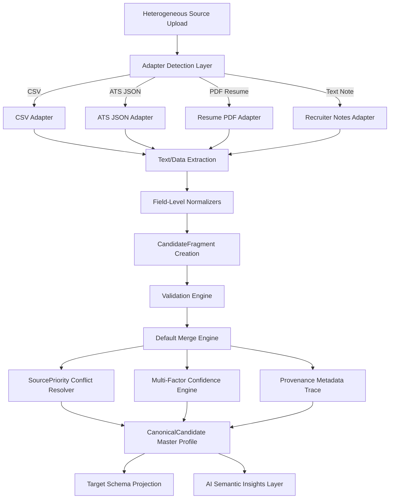

# CandidateCore Engine Architecture & Technical Manual

CandidateCore is a high-performance, fully offline, multi-source Candidate Ingestion & Canonicalization Engine designed to ingest raw, heterogeneous talent profiles (Resumes, ATS Records, Spreadsheets, Recruiter Notes) and resolve overlapping attributes into a single, immutable, mathematically auditable master profile.

---

## 🏗️ Core Architecture Overview

CandidateCore utilizes a modular, layer-oriented architecture with clean separation of concerns:



### 1. Ingestion & Adapter Matching
* Heterogeneous files are scanned via structural boundaries (signature matches, file extensions, headers).
* Specific adapters extract unstructured text or parsed mappings.

### 2. Processing & Standardization
* Core components run formatting cleanups: Phone standardizer (E.164-digits), Emails (lowercase trim), Dates (YYYY-MM-DD standardizer), Corporate names (strips LLC/Inc suffixes), Countries (standard title names mapping).

### 3. Identity Resolution & Field Merging
* Attributes resolved field-by-field.
* Group equivalent values, assess cross-source agreements, and count consensus rates.
* Deduplicate complex chronologies (Experience company/title nodes and Education school/degree nodes).
* Tie-breaker priority: ATS JSON -> Resume PDF -> Recruiter CSV -> Recruiter Notes.

### 4. Audit & Explainability
* Resolvers append a descriptive `selection_reason` mapping why a winner was chosen.
* Full alternative inputs retained in `competing_values` histories with validation and confidence scores.

### 5. Schema Target Projection
* Output translates into targeted flat layouts matching custom whitelist inclusions, exclusions, and rename remappings.
* Supports nested path constructions using dot-notation path mappings (e.g. `name.first` translates to `{"name": {"first": "..."}}`).

### 6. AI Semantic Isolation Layer
* Natural language notes scanned to summarize candidate observations.
* **Strict Safety Barrier**: The AI output remains separated from deterministic master attributes. AI metadata is clearly marked as "Not Canonical Data" and cannot write/modify factual core fields.

---

## 📂 System Project Layout

```
CandidateCore/
├── backend/
│   ├── app/
│   │   ├── adapters/          # Ingestion parsers (PDF, CSV, JSON, TXT)
│   │   ├── api/               # Router endpoints (Pipeline, Projection, Health)
│   │   ├── config/            # Dependency initializers
│   │   ├── exceptions/        # Custom exception handlers & status mapping
│   │   ├── logging/           # Structured JSON formatter logging
│   │   ├── models/            # Frozen canonical master schemas
│   │   ├── services/
│   │   │   ├── confidence/    # Multi-factor weights scoring
│   │   │   ├── enrichment/    # Recruiter notes semantic analyzers
│   │   │   ├── merge/         # Merge engines & tie-breakers
│   │   │   ├── normalization/ # Field formatting standardizers
│   │   │   ├── projection/    # Schema custom translators
│   │   │   └── provenance/    # Lineage trackers
│   │   └── main.py            # Main application boot
│   └── tests/                 # Full unit and integration test suite
├── frontend/
│   ├── app/                   # Single page dashboard & visual layouts
│   ├── components/            # UI components (Upload zones, Cards, Drawers)
│   └── lib/                   # API clients and typings
└── DOCUMENTATION.md           # This architecture manual
```

---

## ⚙️ Running Locally

### Backend Setup
1. Move to backend directory:
   ```bash
   cd backend
   ```
2. Activate Virtual Environment:
   ```bash
   source .venv/bin/activate
   ```
3. Run Local Server:
   ```bash
   uvicorn app.main:app --reload --port 8000
   ```

### Frontend Setup
1. Move to frontend directory:
   ```bash
   cd frontend
   ```
2. Run Developer Instance:
   ```bash
   npm run dev
   ```
3. Access UI Console: Open [http://localhost:3000](http://localhost:3000)

---

## ⚖️ Architectural Trade-offs & Limitations

### In-Memory Processing
* *Decision*: The API resolves profiles in-memory.
* *Trade-off*: Memory usage scales with candidate quantity. For high throughput enterprise applications, this should be offloaded to database records (e.g. PostgreSQL JSONB).

### String Identity Mapping
* *Decision*: Standard string normalizers are used instead of vector databases.
* *Trade-off*: Handles minor spelling and casing differences but will miss complex company name alias matches (e.g. "Big Blue" vs "IBM"). Future versions should integrate offline vector index embeddings to capture semantic equivalence.

### AI Isolation Policy & Authoritative Data Integrity
* *Decision*: Semantic enrichment insights are strictly informational and separated from the core profile.
* *Trade-off*: Prevents AI from correcting factual data errors, but guarantees that the candidate profile remains 100% deterministic, audit-trail verified, and clean of hallucinated attributes.

---

## 🤖 AI Semantic Enrichment & Separation Philosophy

### 1. Why AI is Optional
Large Language Models (LLMs) are probabilistic engines. In recruitment systems:
* Candidate search, filtering, and automated screening require absolute factual precision.
* Enabling AI by default would introduce potential non-deterministic latency and third-party API dependencies.
* Recruiters must explicitly choose when to leverage AI analysis to reduce redundant API calls and optimize operational budgets.

### 2. Why Deterministic Processing Remains Authoritative
At Eightfold AI, data auditability is paramount. Every canonical candidate field must trace directly to a source fragment with clear math weights, validation warnings, and consensus scoring:
* If a recruiter challenges why a candidate's email or phone number is chosen, the engine must prove the lineage deterministically via conflict resolution rules.
* If probabilistic AI was permitted to edit canonical values, audit trails would become contaminated with probabilistic guesses, destroying compliance and transparency guarantees.

### 3. Separation of Enrichment from Canonicalization
The Semantic Enrichment Engine executes only **after** the Canonical Candidate Profile is fully compiled:
* It reads the finalized candidate JSON structure and original notes text.
* It operates as a read-only insight card without mutating core fields (first name, email, phones, experience, etc.).
* By keeping the service decoupled, model changes (e.g. replacing Gemini with a local model or another LLM) will have zero impact on ingestion logic.

### 4. Future Extension Possibilities
* **Cross-Attribute Semantic Mapping**: Expanding the schema to map canonical skills to standardized taxonomies (e.g. "python3" -> "Python Development") using LLM reasoning.
* **Smart Interview Questions Generator**: Generating customized interview guides tailored to the candidate's highlighted potential concern areas and technical highlights.
* **Auto-generated Job Matching Scores**: Calculating semantic score overlays comparing candidate summaries against target job descriptions.

