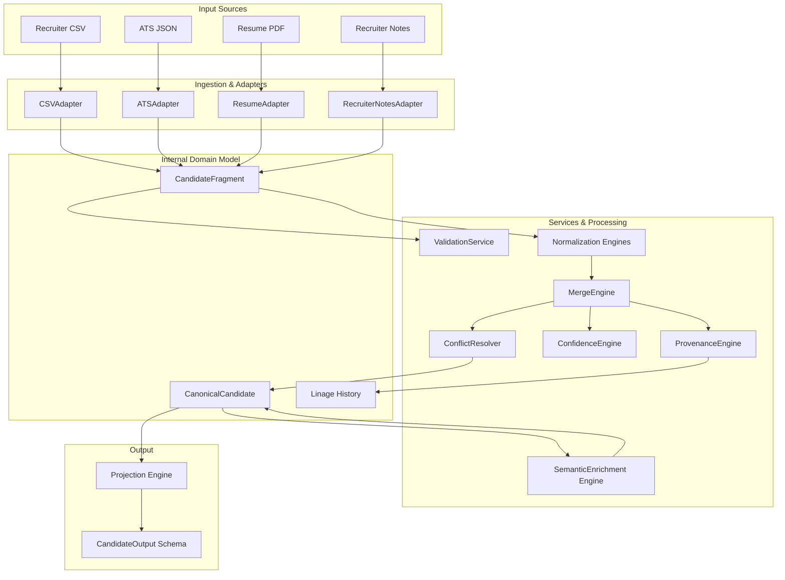

# CandidateCore Architecture Design Document

This document outlines the system architecture, component layout, and structural design choices of the Candidate Ingestion and Canonicalization Engine (`CandidateCore`).

---

## 1. Architectural Blueprint & Data Flow

---

## 2. Core Architectural Pillars

### I. Separation of Concerns (Internal vs External Models)
The pipeline strictly separates the internal rich domain model (`CanonicalCandidate`) from the clean external representation (`CandidateOutput`). The internal model holds complex objects with provenance, conflict history, and confidence scores, which is too heavy for consumers. The `ProjectionEngine` flattens and maps the internal model to the external `CandidateOutput` schema.

### II. Immobility of Canonical Profiles
The `CanonicalCandidate` profile is defined as a frozen Pydantic structure. Once written, no service can modify it. Any changes (such as asynchronous AI semantic enrichments) return a copy-on-write representation.

### III. Unified Raw Ingest (`CandidateFragment`)
Different data formats are parsed, validated, and normalized inside their respective adapters. They exit the adapter layer as a standardized `CandidateFragment`. Merging logic never communicates directly with raw payloads.

### IV. Granular Linage Traceability (`CanonicalField[T]`)
Rather than storing simple types, attributes in `CanonicalCandidate` wrap values inside a `CanonicalField[T]`. This metadata tracks:
* **Provenance**: Source identifier, format type, extraction timestamp, raw input.
* **Confidence**: Mathematical certainty score and the heuristic criteria used.
* **History**: An audit trail of overridden source fields to trace conflicts.

### V. Field-Level Resilience (Fail Field, Never Fail Pipeline)
If validation checks find errors on specific entries, the pipeline flags the issue under `PipelineStatus.errors` but continues processing other sources and attributes rather than crashing the whole job.

---

## 3. Class Directory & Core Responsibilities

| Directory | Components | Responsibility |
| :--- | :--- | :--- |
| `app/adapters/` | `CSVAdapter`, `ATSAdapter`, `ResumeAdapter`, `RecruiterNotesAdapter` | Parse raw payloads, validate schemas, and compile candidate fragments. |
| `app/models/` | `CandidateFragment`, `CanonicalCandidate`, `CandidateOutput`, `FieldMetadata` | Represent the data schemas and structures across the pipeline boundaries. |
| `app/services/` | `MergeEngine`, `ConfidenceEngine`, `ProjectionEngine`, `SemanticEnrichmentEngine` | Core services executing normalization, conflict resolution, score calculations, AI inference, and projection mapping. |
| `app/config/` | `settings.py` | Configuration management and environment variables (e.g. `GEMINI_API_KEY`). |
| `app/exceptions/` | `custom_exceptions.py`, `handlers.py` | Unified exceptions and global route middleware. |
